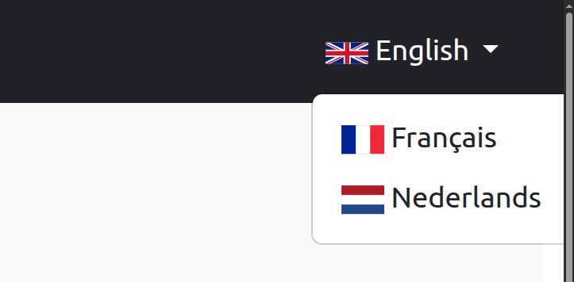

## Description

A locale switcher dropdown for Bootstrap navbar.



## Configuration

```yaml
cycling_apps_component:
  locale_switcher:
    locales: ['fr', 'en']
    show_locale_name: true
```

| Parameter          | Type    | Description                                     | Default        |
|:-------------------|:--------|:------------------------------------------------|:---------------|
| `locales`          | `array` | Available locales for the application           | `['fr', 'en']` |
| `show_locale_name` | `bool`  | Whether to show the locale name in the switcher | `true`         |


## Usage

```twig
{{ component('cyclingapps_locale_switcher') }}
```

## Example in a Bootstrap navbar
```twig
<nav class="navbar navbar-expand-md navbar-dark bg-dark">
    <div class="container-fluid">
        <a class="navbar-brand" href="#">CyclingApps</a>
        <button class="navbar-toggler" type="button" data-bs-toggle="collapse" data-bs-target="#navbarSupportedContent"
                aria-controls="navbarSupportedContent" aria-expanded="false" aria-label="Toggle navigation">
            <span class="navbar-toggler-icon"></span>
        </button>
        <div class="collapse navbar-collapse" id="navbarSupportedContent">
            <ul class="navbar-nav me-auto mb-2 mb-lg-0">
                ...
            </ul>
            <div class="d-flex align-items-end me-3">
                {{ component('cyclingapps_locale_switcher') }}                
            </div>
        </div>
    </div>
</nav>
```